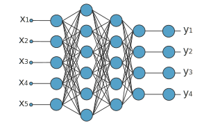
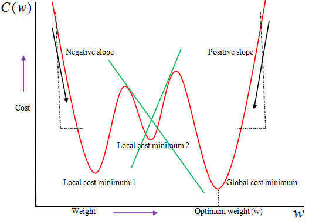

# Tic-Tac-Toe-Machine-Learning 🧠
A side project where I trained an ai to learn to play Tic Tac Toe.

# Inspiration
A couple resources I used for making the project are listed below

 - https://www.youtube.com/watch?v=aircAruvnKk&list=PL_h2yd2CGtBHEKwEH5iqTZH85wLS-eUzv
 - https://www.youtube.com/watch?v=hfMk-kjRv4c&t=2414s
 - https://realpython.com/python-ai-neural-network/

# How it works

Think of the model as a "function", with that takes in an input and returns a output.  

### What is a model
  >   The model is a system of linear equations like `z = aw + b`. It consists of multiple layers each with nodes which is bassically just a value between 1 and 0.
  
- `a`: Being the previous layers outputs
- `w`: The weights associated with each node
- `b`: The bias associated with each node   
    Every equation gives us a output and that output is called the nodes. But adding linear functions will only give you a linear function. So you have to use something called a activation function for each output.   
For my network in particular I used the `Sigmoid Activation Function` It's definition is `y = 1 / (1+(e^-x))` 
  

So at first the model starts with random weights and biases then calculates the `Average Cost` of the function. Which is bassically how bad the function is at it's job. The higher the cost the worse the model. 

Bassically the model wants to find the lowest point of the graph, or the lowest `Average cost`. And using some derivatives we can calculate the slope of the graph to find how much we need to change the values to get to that local minumum.

For my model I simply made the model play against a bot that would play the optimal move 50% of the time. And it would record what the model predicted as the best response move and calculate the `Gradient Descent` for the model to make the output more like the optimal move.

# Usage ⚙

You can run `main.py` however you'd like, to change the paramaters go to the bottom of the file and change the paramaters going to `Main`

### Arguements
 > Tests:  
 > - How many times trials each thread will face the model against the training bot 

 > Momentum Conservation
 > - The percent of the old gradient descent that is added to the current gradient descent

 > Learning Rate: 
 > - This changes how much and how quickly the model changes. The higher the faster but it may actually miss it's target's value and fail to actually train effectively.

 > Dimensions: 
 > - The amount of layers in the model and the amount of nodes within each layer.

 > Threads: 
 > - How many CPU Threads the program will use for training

### Visualization
You can run `animate.py` to get a graph of the average accuracy for each generation

To begin training a new model just simply empty the contents of `data.py` and restart `main.py`

### Playing aginst the model

You can run `play.py` to be able to play against the bot.

# Extra
The way it's trained is pretty slow and can be optimized very easily, but for now I'm just uploading this.

The bot you train will ussually be able to hold up against a intermediate player.
